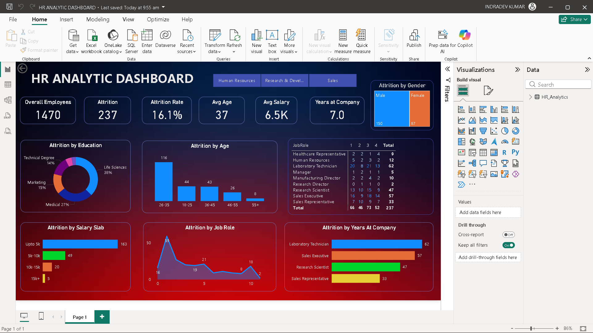

# HR Analytics Dashboard – Power BI

## Project Summary
This project involves building an HR Analytics dashboard using Power BI to analyze employee data and attrition trends. The dashboard helps understand workforce distribution, employee turnover, and key factors influencing attrition, enabling data-driven HR decision-making.

## Key Objectives
- Analyze total employees, active employees, and attrition rate
- Study employee attrition based on:
  - Age group
  - Education level
  - Salary slab
  - Job role
  - Years at the company
- Support HR teams in improving employee retention and performance

## Key Insights
- Attrition varies across job roles and experience levels
- Certain salary ranges and age groups show higher turnover
- Education background impacts employee retention trends

## Tools & Skills Used
- Power BI  
- Data Analysis  
- Data Cleaning & Transformation  
- Data Visualization  
- DAX (Measures & KPIs)  
- HR Analytics

## Dashboard Preview

## Outcome
The dashboard provides actionable insights that help organizations identify attrition-prone areas and improve HR strategies.

## Author
**Indradev**

